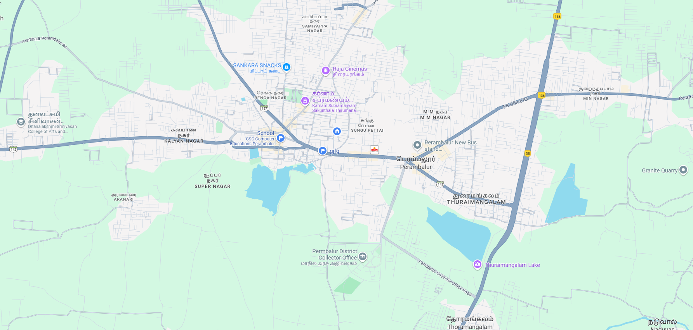

# Ex04 Places Around Me
# Date:24-09-2025
# AIM
To develop a website to display details about the places around my house.

# DESIGN STEPS
## STEP 1
Create a Django admin interface.

## STEP 2
Download your city map from Google.

## STEP 3
Using <map> tag name the map.

## STEP 4
Create clickable regions in the image using <area> tag.

## STEP 5
Write HTML programs for all the regions identified.

## STEP 6
Execute the programs and publish them.

# CODE
```
map.html
<html>
    <head>

        <title>Map</title>
        <meta name="viewport" content="width=device-width, initial-scale=1.0">
        <style>
            body{
                
             background-image: linear-gradient(120deg, #3e47fc, #e04bae);
            }
        </style>
    </head>
        <body>
            <center>
            <h1>PERAMBALUR</h1>
            <H1>B.DHIVAKAR(25016480)</H1>   
            </center>
            
            <map name="imagemap">
                <area shape="poly" coords="953,298,895,342,949,445,1095,471,1180,390,1049,310,1140,345" title="my heaven" href="heaven.html">
            <area shape="poly" coords="812,116,943,106,804,224,956,222,800,163,865,103,878,222,967,152" title="cinema" href="raja.html">
            <area shape="poly" coords="626,431,698,404,623,533,670,590,747,565,806,475,781,400" title="Arasalur lake" href="lake.html">
        <area shape="poly" coords="263,435,382,427,424,575,242,504,278,600,402,484,356,591,318,420" title="Aranarai" href="ara.html">
        <area shape="poly" coords="935,280,985,295,1007,346,887,306,893,356,950,360" title="My Area" href="pettai.html">    
        </map>
        </body>
    </html>
    heaven.html
  
  <!DOCTYPE html>
<head>
    <style>
        body{
                
             background-image: linear-gradient(120deg, #3e47fc, #e04bae);
            }
    </style>

</head>
<body>
  <center>  <h1>Heaven</h1></center>
    <h3>Ancient sites include the National Fossil Wood Park at Sathanur, where fossilized tree trunks over 18 meters in length from the Cretaceous period are preserved.
Ranjankudi Fort, associated with 18th-century battles, is a notable historical attraction.Temples such as Arulmigu Ekambareshwarar, Thandayudhapani Temple, and Mathura Kaliamman Temple at Siruvachur attract many pilgrims and tourists.
The district has mineral resources like limestone, fire clay, gypsum, black granite, and more, supporting minor industries and building material production</h3>
</body>
</html>

    raja.html
    
    <html>
    <head>
        <title>Raja Cinemas</title>
        <style>
            body{
                
             background-image: linear-gradient(120deg, #3e47fc, #e04bae);
            }
            h3{
                color: white;
            }
            h1{
                color:orange;
            }
            
        </style>
        </head>
        <body><center><h1>Raja Cinemas</h1></center>
    <h3>Raja Cinemas is a well-known movie theater located in Perambalur, Tamil Nadu, serving as a key spot for local entertainment and film releases. It is situated at Elambalur Road, near Sri Ramakrishna Matriculation Higher Secondary School in the Sungu Pettai area, making it easily accessible for visitors from different parts of the town.

The theater is popular for screening the latest Tamil movies, often running multiple showtimes throughout the day to cater to diverse audiences. Raja Cinemas offers standard amenities and is recognized for its convenient location on major connecting roads such as Attur–Perambalur Road and Thuraiyur–Perambalur Road, ensuring that residents from neighboring areas can also enjoy cinema experiences without having to travel far.

For many in Perambalur, Raja Cinemas represents more than just a place to watch films—it functions as a community hub, where friends and families gather for entertainment, festival releases, and even special occasions. Its presence has contributed to the cultural life of the town by providing access to the latest releases and supporting the vibrant tradition of Tamil cinema among local audiences.

</h3>
    </html>
    lake.html

 <html>
    <head>
        <title>Arasalur Lake</title>
        <style>
            body{
                
             background-image: linear-gradient(120deg, #3e47fc, #e04bae);
            }
            h3{
                color: white;
            }
            h1{
                color:pink;
            }
            
        </style>
    <body><center><h1>Arasalur Lake</h1></center>
        <h3>Arasalur Lake is a significant water body located in the Melapuliyur area of Perambalur district, Tamil Nadu. Positioned approximately 16 kilometers from Perambalur town, the lake plays an important role in supporting the local agricultural activities and the surrounding rural communities. The geographic coordinates place it in a zone conducive to collecting seasonal rains, thus serving as an essential reservoir for irrigation and groundwater recharge.

The lake spans a considerable area and is maintained by local authorities to ensure it remains a viable water source for farmers and villagers nearby. Apart from its utilitarian role in irrigation, Arasalur Lake is also known as a natural habitat supporting local wildlife and bird species that frequent the water body during various seasons. It has become part of the village lifestyle, often serving as a hub for social events and traditional activities linked to water resource management.</h3>
    </body>
</html>

    ara.html
   
   <html>
    <head>
        <title>Aranarai</title>
        <style>
            body{
                
             background-image: linear-gradient(120deg, #3e47fc, #e04bae);
            }
            h3{
                color: white;
            }
            h1{
                color: yellow;
            }
            
        </style>
    </head>
    <body>
        <center><h1>Aranarai</h1></center>
        <h3>Agriculture is the primary occupation, with many residents engaged in farming and related activities supported by the fertile lands of Perambalur district. The village lifestyle is a blend of traditional rural living with gradual modernization as infrastructure and services improve. Local governance through the gram panchayat plays a crucial role in community welfare and development effortsAranarai forms part of a vibrant local community with nearby villages like Alangali, Keelakkarai, and Elambalur contributing to the region's social and economic activities. The village governance through the gram panchayat helps address local development needs. The presence of schools, markets, and connectivity options supports the livelihood of residents, who primarily engage in agriculture and related activities in this agrarian district. The village stands as a typical example of rural life in central Tamil Nadu, blending tradition with gradual modernization</h3>
    </body>
</html>

    pettai.html
    
    <html>
    <head>
        <title>Sungu Pettai</title>
        <style>
            body{
                
             background-image: linear-gradient(120deg, #3e47fc, #e04bae);
            }
            h3{
                color: white;
            }
            h1{
                color:gold;
            }
            
        </style>
    <body><center><h1>Sungu Pettai</h1></center>
        <h3>Sungu Pettai is a locality situated in Perambalur city within the Perambalur district of Tamil Nadu. Positioned at an elevation of approximately 70 meters above sea level, it is well-connected through roads such as the Perambalur-Elambalur Road and lies close to significant towns like Thuraiyur and Tittakudi. The area falls under the Perambalur assembly and parliamentary constituencies, with Tamil as the primary language spoken by the residents.

The locality is known for its vibrant community life with numerous educational institutions nearby, including the Roever School of Excellence and Kendriya Vidyalaya, which serve as important centers for learning in the region. Additionally, Sungu Pettai features a variety of healthcare facilities, computer shops, supermarkets, and parks like Teppakulam Park and Children’s Park, contributing to a balanced lifestyle for the residents. The area experiences a moderate climate with temperatures typically ranging from the mid-20s to mid-30s Celsius throughout the year</h3></body>
</html>

views.py
from django.shortcuts import render
def map(request):
    return render(request, 'map.html')
def pettai(request):
    return render(request, 'pettai.html')
def ara(request):
    return render(request, 'ara.html')
def lake(request):
    return render(request, 'lake.html')
def raja(request):
    return render(request, 'raja.html')
def heaven(request):
    return render(request, 'heaven.html')

urls.py
from django.urls import path
from . import views

urlpatterns = [
    path('', views.map, name='map'),
    path('pettai/', views.pettai, name='pettai'),
    path('ara/', views.ara, name='ara'),
    path('lake/', views.lake, name='lake'),
    path('raja/', views.raja, name='raja'),
    path('heaven/', views.heaven, name='heaven'),

]

```
# OUTPUT


# RESULT
The program for implementing image maps using HTML is executed successfully.
